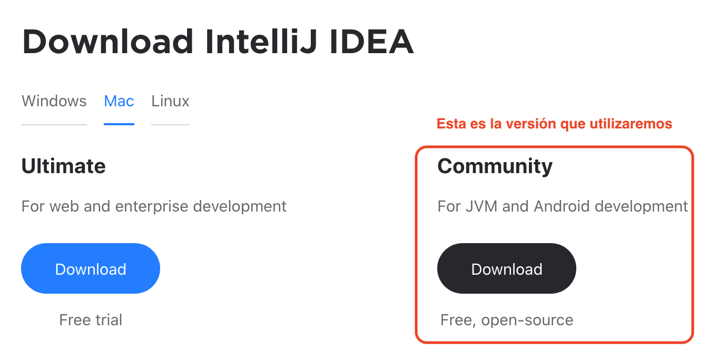
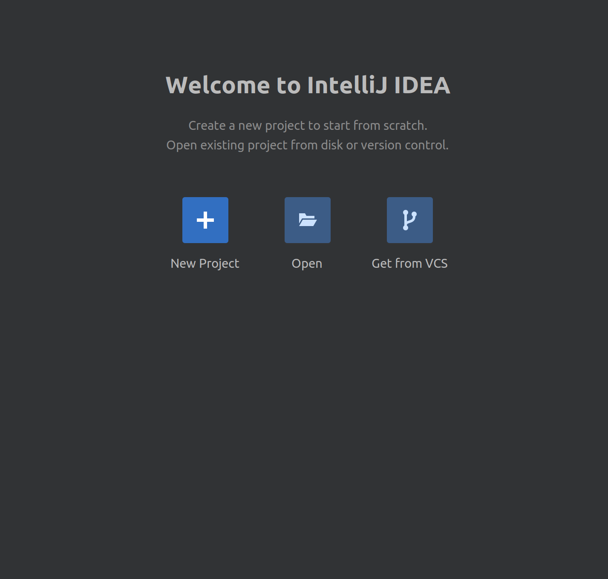
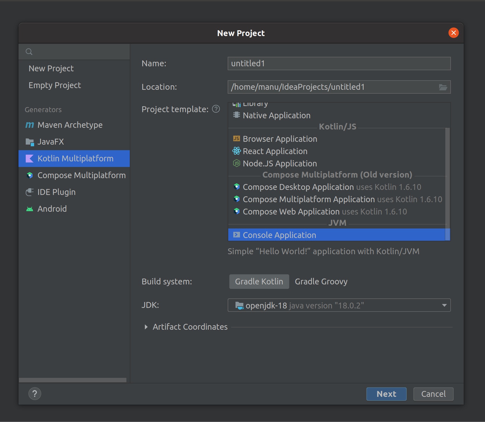

## Primeros pasos - IntelliJ IDEA y hola mundo

### OBJETIVO

- Instalar y configurar la IDE
- Utilizar las herramientas básicas que nos proporciona el entorno de desarrollo
- Crear nuestro primer programa con Kotlin!

#### REQUISITOS

1. Tener suficiente espacio en la memoria para instalar nuestro entorno de trabajo

#### DESARROLLO

##### Instalación de la IDE

Vamos a descargar nuestro entorno de trabajo visitando el sitio web oficial de JetBrains en la sección para descargar el archivo de instalación dependiendo el Sistema Operativo que utilicemos, [clic aquí para visitar la página de descarga](https://www.jetbrains.com/idea/download)



Una vez descargado el archivo, ejecutar e instalarlo para poder crear nuestro primer proyecto.


##### Nuestro primer proyecto

Vamos a crear un nuevo proyecto de kotlin, para esto vamos a ejecutar los siguientes pasos: 

1. Abrimos nuestra aplicación **IntelliJ IDEA**, lo cual provocará que se abra la siguiente ventana:



2. Damos click en *New Project*

3. Aparecerán unas opciones para configurar el tipo de proyecto, seleccionaremos:

    - Generators: **Kotlin Multiplataform**
    - Name: Poner el nombre de su preferencia.
    - Project template: **JVM/Console Application**
    - JDK: **openjdk-18**

    Dejar el resto de opciones por defecto.



4. ¡Todo listo! estaremos ahora en la pantalla del proyecto, donde se encuentra nuestro primer archivo Kotlin con nuestra primera línea de código el famoso **Hello World** , modificado por cierto. El código es el siguiente: 

```kotlin
fun main(args: Array<String>) {
    println("Hello World!")

    // Try adding program arguments via Run/Debug configuration.
    // Learn more about running applications: https://www.jetbrains.com/help/idea/running-applications.html.
    println("Program arguments: ${args.joinToString()}")
}
```
Para correr el código, daremos al botón play verde que se genera en la parte superior de nuestra IDE, la imagen también muestra en la parte inferior la pestaña de run habilitada, que mostrará el mensaje que mandamos a imprimir a la consola.
