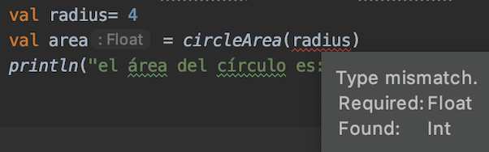
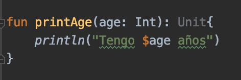

# Funciones

## OBJETIVO

- Definir funciones en códigos para modularizarlo.

## REQUISITOS

1. Tener una noción del concepto de función en programación.

## DESARROLLO

### General

- En esta serie de ejercicios aprenderemos a definir y crear funciones en Kotlin.

- Una función es una serie de instruccicones para lograr un objetivo específico.

- La sintaxis de su definición es  la siguiente: 

    ```kotlin
    fun nombre([Argumentos: tipo de dato]): [Tipo de dato de regreso] {
        ...
        [código a ejecutar]

        return [valor de salida]
    }
    ```

- Vamos a crear una función que calcule el área de un círculo, para esto definiremos el número pi como constante y crearemos una función.

    ```kotlin
    import kotlin.math.pow
    ...
    fun areaCirculo (radio:Float): Float{  
        return PI*radio.pow(2)
    }
    ```

- `pow` es un **método** que vive en la clase `Float` (o en otros tipos numéricos) y eleva un número a cierta potencia (en este caso al cuadrado).

    Estudiaremos con mas detalle conceptos relacionados con Orientación a Objetos en sesiones futuras.

- Ahora vamos a sacar el área de un círculo e imprimirlo en pantalla.

    ```kotlin 
    ...
    fun main(){
        val radio = 4
        val area = areaCirculo(radio)
        println("El área del círculo es: $area")	
    }
    ...
    ```

    ¿Qué sucede? El error reflejado nos indica que el tipo del parámetro esperado es un *Float* y estamos ingresando un *Int*

    

    *En la imagen podemos observar que el orden en las funciones no importa*

    Por lo tanto, debemos convertir nuestro valor *radius* en flotante.

    ```kotlin
    val radio = 4f
    ```

    corremos el código y nos devuelve lo siguiente:

    > el área del círculo es: 50.2656


- Unit es el tipo de dato que se declara en una función en Kotlin para avisar que no se devuelve un dato, pero no es necesario especificarlo. Es equivalente a `void` en otros lenguajes.

    ```kotlin
    fun imprimeNombre(nombre: String) {
        println("Mi nombre es $nombre")
    }

    fun imprimeEdad(edad: Double): Unit {
        println("Tengo $edad años")
    }
    ```

    En el editor de Idea, veremos el tipo de dato *Unit* en gris porque la declaración es redundante.

    

    Llamamos en *main* las dos funciones creadas para imprimir en pantalla:

    ```kotlin
        imprimeNombre("Fulanito de tal")
        imprimeEdad(15)
    ```

    **Nota:** a pesar de que la función *imprimeEdad* recibe la edad como entero, el *String template* hace la conversión del entero a String.

- Ahora utilizaremos una función que no requiera ningún parámetro de entrada, regresaremos el valor de PI de la variable constante ya definida

    ```kotlin
    fun obtenPI(): Float{
        return PI
    }
    ```

    y la llamamos desde *main()*

    ```kotlin
    println(obtenPI())
    ```

- Finalmente vamos a declarar una función que no reciba ningún parámetro y que no devuelva ningún valor:

    ```kotlin
    fun imprimePHI(){
        println("El número áureo vale $PHI")
    }
    ```

    y la agregamos en nuestra función *main()* :

    ```kotlin
    imprimeFunciones()
    ```
    El resultado debe ser: 

    > El número áureo vale 1.618


### Local functions (Funciones locales)

Una función local es básicamente una función dentro de otra. Tiene las siguientes características:

- Es una función disponible únicamente dentro de la función que la contiene.

- Se declara como una función común y cualquiera.

- Mantiene limpio el código al ayudar a establecer las jerarquías y conexiones entre funciones.

- Agrega reusabilidad al código.


Vamos a crear una función `login` que valide usuario y contraseña. Dicha función se llamará `validar` y recibirá nuestro parámetro a evaluar (para este caso, si la variable no está vacía).

```kotlin
    //Funciones locales
    fun login(usuario: String, contrasenia: String) : Boolean {
        fun validar(entrada: String): Boolean{
            !entrada.isEmpty()
        }
        val uv = validar(usuario)
        val cv = validar(contrasenia)

        return uv && cv
    }
```

Después, hay qué correr la función como sigue

```kotlin
    val foo = login("Juanito","Navaja") 
    println("¿Usuario loggeado? $foo") 
```

### Default Arguments y Named Arguments

Los ejemplos anteriormente vistos pasan sus parámetros en orden, de la misma forma en la que se declaran en la creación de la función, de modo que si tuviéramos dos parámetros de distintos tipos e invirtiéramos el orden de estos al momento de llamar la función, nos daría un error porque los tipos de datos no coincidirían con los de la definición. De la misma forma, si el número de parámetros ingresados en la llamada de la función son distintos al de la declaración, marcará otro error. Crearemos una función para el área de un rectángulo:

```kotlin
fun areaRectangulo(base:Double, altura: Double):Double{
    return base*altura
}
```

llamamos la función sin pasar argumentos:

```kotlin
println("Area con valores por defecto: ${areaRectangulo()}")
```

El resultado obtenido es:

> <p style="color=red">Error:(..,..) Kotlin: No value passed for parameter 'base'</p>

Como siempre debemos tener un valor para esos parámetros, existe una forma de establecer valores por defecto en caso de la ausencia de uno o más parámetros:

```kotlin
fun areaRectangulo(base:Double = 20.0, altura: Double = 30.0):Double{
    return base*altura
}
```

Determinamos entonces base con valor 20 y altura como 30 en caso de no pasarlos como parámetro. Hacemos dos pruebas; la primera sin argumentos, y la segunda solo con la base:

```kotlin
    //correr area rectangulo con los valores por defecto
    println("Area con valores por defecto: ${areaRectangulo()}")

    //Area de rectangulo con base asignada y altura por defecto
    println("Area con altura por defecto: ${areaRectangulo(10.0)}")
```

para el primer ejemplo, se ocupan los valores por defecto 20x30 = 600. Para el segundo, la base es 10 y la altura es por defecto, o sea 10x30 = 300.

Si queremos poner únicamente la altura, no podemos hacerlo debido a que el orden de los argumentos nos obliga a poner primero la base para determinar la altura. Afortunadamente, los named arguments permiten pasar argumentos a funciones por medio de su nombre y prescindiendo del orden en que se declaran. Entonces, si queremos asignar únicamente altura, solo tenemos qué poner el nombre y su valor dentro de los paréntesis:
```kotlin
    //Area de rectangulo con por defecto y altura seteada con named arguments
    println("Area con base por defecto: ${rectangleArea(altura = 10.0)}")
```

    
En este caso, la base vale 20 y la altura 10, por lo tanto 20x10 = 200.

Podemos determinar los dos parámetros con argumentos nombrados (named arguments) sin ningún problema y en el orden que sea:

```kotlin
//Asignar base y altura con named arguments
println("Area con datos determinados con named arguments: ${areaRectangulo(altura = 2.0,base=3.5)}")
```

En este caso, el valor arrojado es de 2x3.5 = 7. 

Puedes intentar cambiar el orden para verificar que esto no afecta al resultado de la función.
